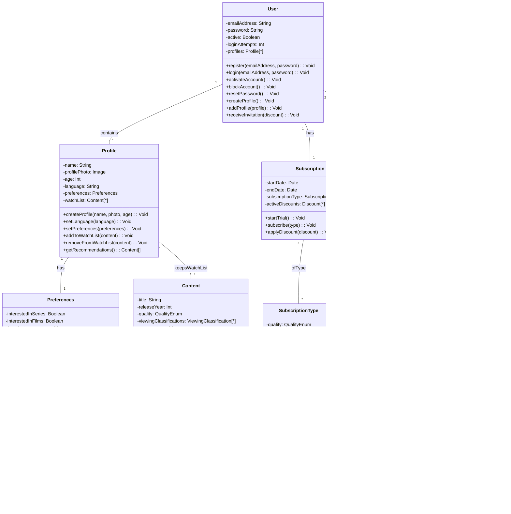
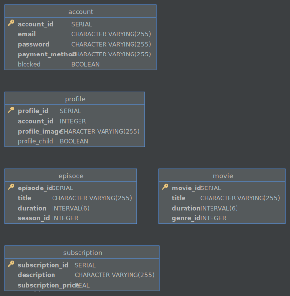

# System Design

## Api

### Class Diagram

```mermaid
classDiagram
class User {
    -emailAddress: String
    -password: String
    -active: Boolean
    -loginAttempts: Int
    +register(emailAddress, password): Void
    +login(emailAddress, password): Void
    +activateAccount(): Void
    +blockAccount(): Void
    +resetPassword(): Void
    -profiles: Profile[*]
    +createProfile(): Void
    +addProfile(profile): Void
    +receiveInvitation(discount): Void
}

class Profile {
    -name: String
    -profilePhoto: Image
    -age: Int
    -language: String
    -preferences: Preferences
    +createProfile(name, photo, age): Void
    +setLanguage(language): Void
    +setPreferences(preferences): Void
    -watchList: Content[*]
    +addToWatchList(content): Void
    +removeFromWatchList(content): Void
    +getRecommendations(): Content[]
}

class Preferences {
    -interestedInSeries: Boolean
    -interestedInFilms: Boolean
    -favoriteGenres: Genre[*]
    -ageRestriction: Int
    -viewingClassification: ViewingClassification[*]
}

class ViewingClassification {
   -description: String
}

class Content {
    -title: String
    -releaseYear: Int
    -quality: QualityEnum
    -viewingClassifications: ViewingClassification[*]
    -genres: Genre[*]
    -viewCount: Int
    +watch(): Void
    +pause(): Void
    +resume(): Void
}

class Film extends Content {
    -duration: Int
}

class Series extends Content {
    +getNextEpisode(): Episode
}

class Episode {
    -episodeNumber: Int
    -seasonNumber: Int
    -duration: Int
    +watch(): Void
}

class Subscription {
    -startDate: Date
    -endDate: Date
    -subscriptionType: SubscriptionType
    +startTrial(): Void
    +subscribe(type): Void
    -activeDiscounts: Discount[*]
    +applyDiscount(discount): Void
}

class SubscriptionType {
   -quality: QualityEnum
   -price: Decimal
}

class Discount {
    -amount: Decimal
    -inviter: User
    -invitee: User
    +applyDiscountToUsers(): Void
}

User "1" -- "*" Profile : contains
Profile "1" -- "1" Preferences : has
Profile "1" -- "*" Content : keepsWatchList
Content "0..*" -- "0..*" ViewingClassification : taggedWith
Content "*" -- "*" Genre : categorizedIn
Content "1" <|-- "*" Film : isTypeOf
Content "1" <|-- "*" Series : isTypeOf
Series "1" -- "*" Episode : containsEpisodes
User "1" -- "1" Subscription : has
Subscription "*" -- "*" SubscriptionType : ofType
Subscription "*" -- "*" Discount : discounts
Discount "0..1" -- "2" User : involvesUsers
```

### Endpoints

## Database

### Entity Relationship Diagram (ERD)

### Views

### Stored Procedures

### Triggers

## Architecture Diagram