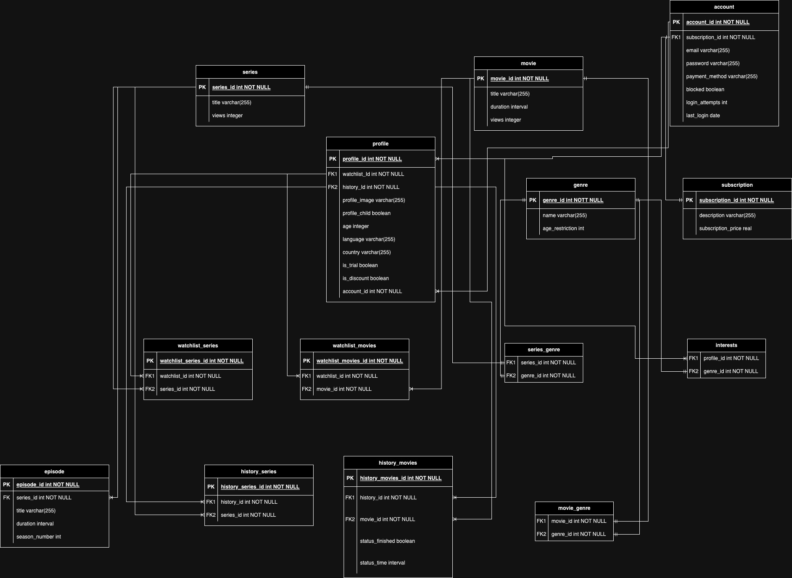

# System Design

Welcome to the system design document for Data Processing Assignment. This document serves as a comprehensive guide detailing the architecture, components, and functionalities of the system. It aims to provide a clear understanding of the design choices, technical specifications, and implementation strategies involved in building and maintaining our frontend and API for the Netflix Usecase.

Within these pages, you'll discover an in-depth exploration of the system's objectives, scope, and key features. Additionally, this document outlines the interactions between various modules and security measures employed to ensure the robustness and reliability of our system.

## Architecture Design


## Backups

For backups we suggest following the 3-2-1 rule.

+ Production data (Copy 1, Production server)
+ Backup (Copy 2, On-site server)
+ Disaster recovery (Copy 3, Off-site server).

We suggest using cron to automatically create a backup of the database daily using ```backup.sh```.
The backup file should then be copied over to a separate on-site file storage server.

The backups should be copied to the off-site disaster recovery media at least once a week.

The backups should be retained for a maximum of one week.

You can use the ```restore.sh``` script to restore a backup. But make sure to stop docker first and it may cause issues when restoring.

## API

The API will function as a middleman system between the front-end and the database and will satisfy at least the following conditions:

#### Framework Choice

Our project team decided to use Flask because a member of our team had some experience with Flask. Additionally, making an API in Python just sounded nice.

#### External Integration

As we are making an Netflix API, we decided that it's only fitting to use a public movie API to display additional information about the movies.

#### Data Handling

Clients using the API have the choice to request JSON or XML data using the ```Accept:``` HTTP header.

#### Endpoints and Response Handling

The comprehensive openapi specifications of the endpoints can be found at ```/api/v1/docs``` when connected to the web server.

#### Database Interaction

The API connects to the database with psycopg using a connection string.

#### Security and Authentication

User password are stored in the database in a hashed and salted format. The user privileges are managed by the database making it harder to access privileged information by accident.

We implemented an interesting way to handle user sessions. That we consider secure by our threat model.
We decided to go this route because we wanted to maintain the user roles in the DBMS for extra security.

When the user logs in, their input is validated. We only accept letters, numbers, and underscores in both password and username. This reduces the possible password complexity but that can be mitigated by using longer passwords. The login information is then encrypted on the server and stored in the JWT token, this is used as a unique identity because we had to work around multithreading, and this was the fastest to implement solution that we have identified. This might sound insecure but here's the reason why why think it's not. First and foremost, in a production environment the requests would be protected by TLS when it transit. The JWT token protects against modifying it's contents, and the login information is encrypted.

In our view, the only way to recover the password is to either, have access to the server or to have full access to the user's computer and log their inputs. That, for us is out of our scope.

To demonstrate here's an example of a JWT token.

```{"alg":"HS256","typ":"JWT"}{"fresh":false,"iat":1705842060,"jti":"17d4bace-eee4-4921-addc-dfc4a584939e","type":"access","sub":"{\"nonce\": \"dScKqOy0cUY=\", \"ciphertext\": \"D24w/JfHdOFXjEDMttJ90Q==\"}","nbf":1705842060,"csrf":"3864eba3-e0d9-4822-86e4-7bc22471698e","exp":1705845660}```

Here, ```sub``` contains the encrypted information.

```{"nonce": "dScKqOy0cUY=", "ciphertext": "D24w/JfHdOFXjEDMttJ90Q=="}```

Please, feel free to decode the above strings with base64, and see for yourself that we are not leaking information.

### Class Diagram


## Database

We decided to use PostgreSQL for our database because none in our team had any experience with it, wanted to try a relational database other than MySQL, and because it's popular/commonly used.

### Entity Relationship Diagram (ERD)



### Views

### Stored Procedures

### Triggers
